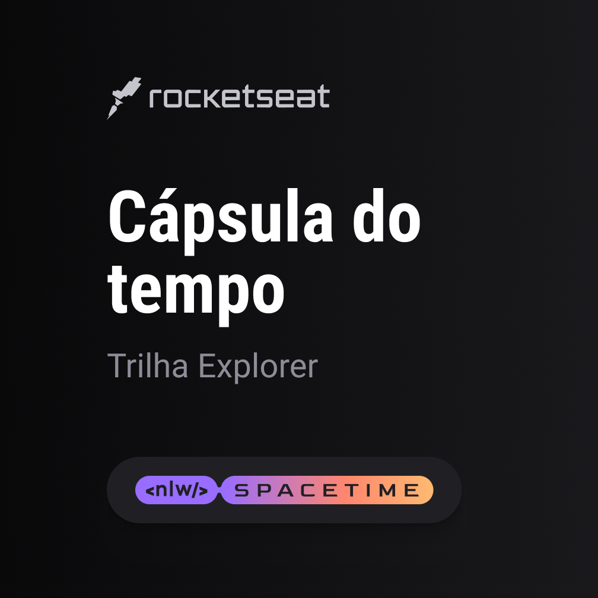

## 💻 Projeto

Esse é um projeto web, responsivo, de uma cápsula do tempo que exibe memórias em uma timeline.

## 🚀 Tecnologias

Esse projeto foi desenvolvido durante a NLW da Rocketseat, Maio de 2023, com as seguintes tecnologias:

- HTML
- CSS
- Git e Github

## 🏷️ Layout

Você pode visualizar o layout do projeto através [desse link](https://www.figma.com/file/qgS3hnYSqufIPOumSa79zs/%5BAmanda%5D---C%C3%A1psula-do-tempo-%E2%80%A2-Trilha-Explorer?type=design&node-id=306%3A84&t=i61FpIKSc0WHbvZ8-1).
É necessário ter uma conta no [Figma](https://www.figma.com).
